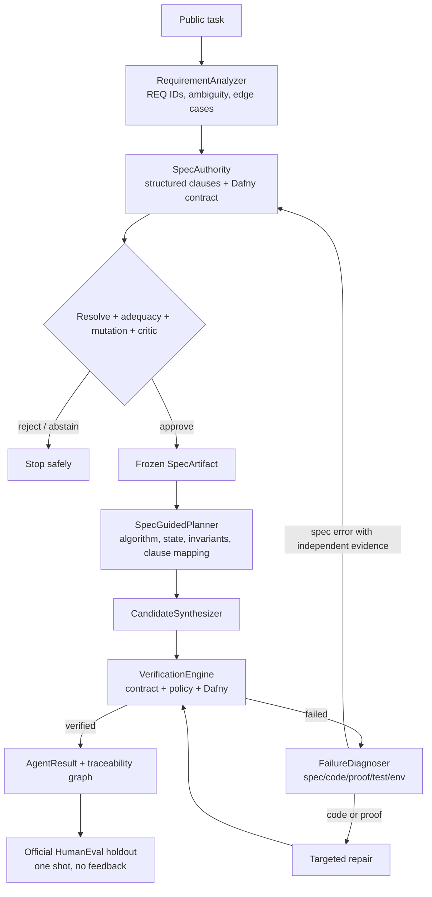

# Codegen Verify

Codegen Verify 是一个以规约为共享中间表示的 Coding Agent。它研究：在相同模型与预算下，
让可追踪、可验证的规约持续参与需求理解、规划、生成、诊断和修复，能否提升代码的真实正确率。

项目面向 HumanEval 纯函数任务，当前形式验证后端为 Dafny。

## 架构



外部执行接口只有 [SpecGuidedAgent.run](project/agent.py)。内部模块：

- [requirement_analyzer.py](project/requirement_analyzer.py)：将公开任务拆成带稳定 ID 的原子需求、歧义、边界条件和验证用例；
- [spec_authority.py](project/spec_authority.py)：同时构建结构化语义规约和 Dafny 形式规约，执行 resolve、充分性、mutation、Critic 与 drift 审查；
- [spec_planner.py](project/spec_planner.py)：为每条 `SPEC-*` 生成算法、状态、不变量和验证策略；
- [candidate_synthesizer.py](project/candidate_synthesizer.py)：根据冻结规约和计划生成代码，根据局部诊断定向修复；
- [verification_engine.py](project/verification_engine.py)：统一契约保真、Reference Collapse 策略和 Dafny 证据，并标记被违反的 Clause；
- [failure_diagnoser.py](project/failure_diagnoser.py)：区分 `SPEC_ERROR`、`CODE_ERROR`、`PROOF_ERROR`、`TEST_ERROR`、`ENV_ERROR` 和 `UNKNOWN`；
- [traceability.py](project/traceability.py)：记录 Requirement、Spec Clause、Plan、Code、VC、Failure 和 Patch 之间的图关系；
- [artifacts.py](project/artifacts.py)：定义跨阶段共享的不可变 IR。

复杂的语义审计仍隐藏在 `SpecAuthority.assess()` 后，不向主循环泄漏 `spec_critic.py`
的内部状态。

## 共享规约 IR

每个任务至少产生以下结构：

```text
REQ-003
  -> SPEC-POST-002
  -> PLAN-1
  -> CODE-1
  -> VC-001
  -> FAIL-001
  -> PATCH-001
```

`SpecArtifact` 包含：

- 原子化 `Requirement`；
- 带 `SPEC-PRE/POST/INV-*` ID 的 `SpecClause`；
- 公开示例与边界验证用例；
- 等价的 Dafny 形式规约；
- 版本、任务哈希和内容指纹；
- Critic、充分性和 mutation 证据；
- 规约修改原因、影响需求和 drift 报告。

规约获批后被冻结。普通代码修复无权删除 `ensures`、加强 `requires` 或修改 Clause。
只有独立开发证据能够重新开启规约，修改后必须重新通过全部规约审查。

## 正确性约束

1. 默认禁止候选使用 `result := Reference(...)` 或等价 helper 直接实现答案。
2. Critic、mutation 或 Dafny 证据不可用时，规约审查 fail closed 为 `abstain`。
3. `strict` 模式下，官方 HumanEval 测试只在 Agent 停止后运行一次，结果不进入修复上下文。
4. `assisted` 模式只接受独立开发测试；不能使用官方测试作为开发集。
5. 最终通过要求规约获批、契约无漂移、Dafny 通过和官方 Holdout 通过。

## 安装

建议使用 Python 3.11/3.12、Dafny 4.11.0，并固定 Z3 版本。

```powershell
python -m venv .venv
.venv\Scripts\Activate.ps1
python -m pip install -r requirements.lock
Copy-Item .env.example .env
```

在 `.env` 中配置 Provider 与 Key：

```dotenv
LLM_PROVIDER=deepseek
DEEPSEEK_API_KEY=...

# 角色可以独立选择模型
REQUIREMENT_MODEL=deepseek-chat
SPEC_MODEL=deepseek-chat
PLANNER_MODEL=deepseek-chat
CODE_MODEL=deepseek-chat
DIAGNOSIS_MODEL=deepseek-chat
REPAIR_MODEL=deepseek-chat
```

Critic 应优先使用不同模型家族。Dafny 不在 PATH 时设置 `DAFNY_PATH` 和
`DAFNY_SOLVER_PATH`。

## 运行

```powershell
python -m pytest tests -q
python -m compileall -q project tests
python project/run_humaneval.py --mode strict --start 0 --limit 5 --rounds 3
```

Assisted 模式必须显式提供独立开发集：

```powershell
python project/run_humaneval.py `
  --mode assisted `
  --repair-tests data/humaneval_dev_tests.jsonl `
  --start 0 --limit 5 --rounds 3
```

每次运行会创建 `logs/runs/<run>/tasks/<task>/`，保存：

```text
requirement.json
spec_vN.json
plan.json
code_final.dfy
verification_final.json
diagnoses.json
traceability.json
metrics.json
result.json
```

结果分析：

```powershell
python project/analyze_results.py logs/runs/<run>/benchmark_final.json
```

## 消融与实验

以下开关用于在相同调用和 Token 预算下做消融：

```dotenv
ENABLE_STRUCTURED_REQUIREMENTS=1
ENABLE_SPEC_PLANNING=1
ENABLE_FAILURE_DIAGNOSIS=1
ENABLE_MUTATION_GUARD=1
ENABLE_SPEC_CRITIC=1
```

至少比较：Direct、Spec Prompt、Spec + Planning、Spec + Verification、Full Agent。
核心指标是 Hidden Test Pass Rate，同时报告 Requirement Coverage、Spec Strength、
Plan Clause Coverage、Formal Verification Rate、Repair Success、Token、延迟和调用次数。

不能只看 verifier pass：代码满足弱规约并不代表满足用户意图，官方 Holdout 才是最终评价。

指南条目与当前实现、保护性取舍及后续增量见
[docs/REFACTOR_GUIDE_IMPLEMENTATION.md](docs/REFACTOR_GUIDE_IMPLEMENTATION.md)。
